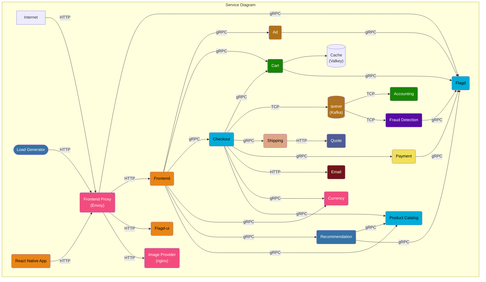
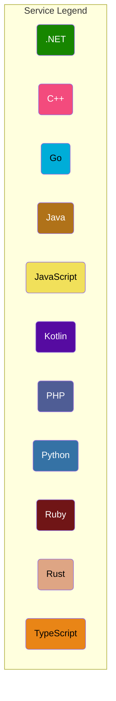

# cloud-native-devops-pipeline-docs
Complete DevOps execution steps for deploying the cloud-native-devops-pipeline project on AWS using Terraform, EKS, GitHub Actions, and Argo CD.

# 📘 Documentation for cloud-native-devops-pipeline

This repo contains the complete step-by-step execution guide for deploying the cloud-native-devops-pipeline on AWS.

---

## 🚀 Project Overview

- Tools used: **Terraform**, **AWS EKS**, **GitHub Actions**, **Argo CD**, **Kubernetes**, **Docker**, **ALB**, etc.

🔗 Main application code: [cloud-native-devops-pipeline repo](https://github.com/NiharikaBS/cloud-native-devops-pipeline)

---

## Architecture Diagram

## 📁 Execution steps 

| Step | Description | Folder |
|------|-------------|--------|
| 🖥️ 0 | Run project locally using Docker Compose | [`run-locally/`](./run-locally) |
| 1️⃣ | Backend setup for Terraform (S3 & DynamoDB) | [`terraform/backend`](./terraform/backend) |
| 2️⃣ | Main Terraform for VPC and EKS provisioning | [`terraform/main`](./terraform/main) |
| 3️⃣ | Kubeconfig configuration | [`scripts/`](./scripts) |
| 4️⃣ | Kubernetes manifests & deployment files | [`k8s/`](./k8s) |
| 5️⃣ | ALB Ingress Controller setup | [`alb-ingress/`](./alb-ingress) |
| 6️⃣ | GitHub Actions workflows for CI | [`.github/workflows/`](./.github/workflows) |
| 7️⃣ | Argo CD setup and deployment | [`argo-cd/`](./argo-cd) |

---

## 🛠 Tools Used

- **AWS** (EKS, S3, DynamoDB, IAM, CloudWatch)
- **Terraform** (Infrastructure as Code)
- **Kubernetes** (Helm, Ingress, Services)
- **GitHub Actions** (CI)
- **Argo CD** (CD)
- **Docker**, **OpenTelemetry**

---

## 📸 Screenshots (Optional)

_Add screenshots for:_
- Argo CD UI
- GitHub Actions run
- Services in AWS/EKS
- LoadBalancer access

---

